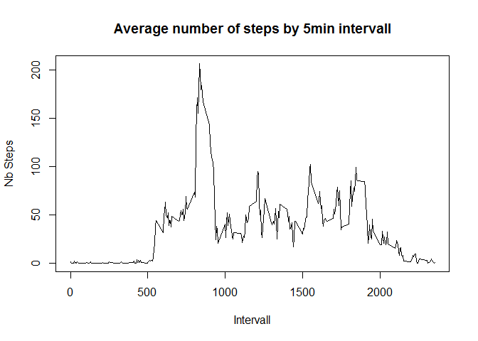
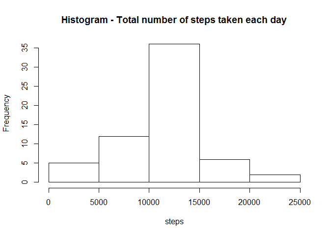
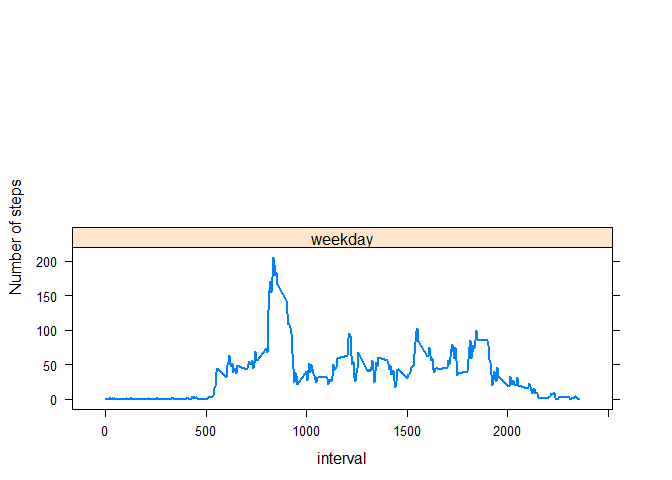

# Reproducible Research: Peer Assessment 1

Initialisation : 

For this assignement, we need to set some general options (regarding number format) and the current locale should be set to english


```r
options(scipen = 6, digits = 2)
Sys.setlocale("LC_TIME", "English")
```

```
## [1] "English_United States.1252"
```


## Loading and preprocessing the data


For this assignement, we assume that data is already in the working directory. We simply unzip and load the activity data into R as a data frame.


```r
unzip(zipfile = "activity.zip")
activity <- read.csv("./activity.csv", na.strings="NA")
```

Now, we convert the date variable from factor to a date type which is more suitable for this analysis (using the `lubridate` library for the conversion).


```r
library(lubridate)
activity$date <- ymd(activity$date)
```


## What is mean total number of steps taken per day?

In this part of the analysis, we will simply ignore the missing value from the intial dataset. So, we first create a dataframe, filtering out the missing values (using the `dplyr` library to make the new dataset).


```r
library(dplyr)

activity.plot1 <- activity %>%
                  filter(!is.na(steps)) %>%
                  group_by(date) %>%
                  summarize(totalSteps=sum(steps))
```

#### 1. Histogram

Below is a simple histogram of the total number of steps taken each day :


```r
hist(activity.plot1$totalSteps, main="Histogram - Total number of steps taken each day", xlab="steps")
```

 

#### 2. Calculations & Results

Now we calculate the mean and median total steps per day.


```r
## mean
mean(activity.plot1$totalSteps, na.rm = T)
```

```
## [1] 10766
```

```r
## median
median(activity.plot1$totalSteps, na.rm = T)
```

```
## [1] 10765
```

The mean number of daily steps is 10766.19, and the median number of daily steps is 10765.

## What is the average daily activity pattern?

We create a new dataframe so that it is easier to make the plot : 


```r
activity.plot2 <- activity %>%
                  filter(!is.na(steps)) %>%
                  group_by(interval) %>%
                  summarize(meanSteps=mean(steps))
```


#### 1. Plot

Below is a time series plot of the 5-minute interval (x-axis) and the average number of steps taken, averaged across all days (y-axis)


```r
plot(activity.plot2$interval, activity.plot2$meanSteps, type="l",
     xlab="Intervall",
     ylab="Nb Steps",
     main="Average number of steps by 5min intervall")
```

 

#### 2. Calculation & Result

Which 5-minute interval, on average across all the days in the dataset, contains the maximum number of steps ?


```r
maxDay <- activity.plot2 %>%
          filter(meanSteps==max(meanSteps))
```


The maximum number of steps is contained in the interval #835, which is in line with the plot above.


## Imputing missing values

The presence of missing days may introduce bias into some calculations or summaries of the data. Until now, we just ignored missing values in the data. At this stage we are going to deal with missing values, trying to fill them and see what are the effects.


#### 1. Number of missing values

We calculate the total number of missing values in the dataset (i.e. the total number of rows with NAs)


```r
activity.na <- activity %>%
  filter(is.na(steps))

length(activity.na$steps)
```

```
## [1] 2304
```

There are 2304 missing values in the dataset.


#### 2. Strategy for filling in missing values 

For our anlysis, we'll be using the mean of that particular 5-minute interval to fill in the missing values. 

#### 3. New dataset

We create a new dataset that is equal to the original dataset but with the missing data filled in with the mean of the corresponding 5-minute interval


```r
activity.nafilled <- activity

activity.nafilled$steps[is.na(activity.nafilled$steps)] <- activity.plot2$meanSteps[match(activity.nafilled$interval,activity.plot2$interval)][is.na(activity.nafilled$steps)]
```

#### 4. Histogram

We make a new data frame again for the total daily steps


```r
activity.plot3 <- activity.nafilled %>%
  filter(!is.na(steps)) %>%
  group_by(date) %>%
  summarize(totalSteps=sum(steps))
```

Below is an histogram of the total number of steps taken each day with this new imputed data to compare with the original.


```r
hist(activity.plot3$totalSteps, main="Histogram - Total number of steps taken each day", xlab="steps")
```

 


#### 5. Calculation & Result

Now, We calculate and report the mean and median total number of steps taken per day


```r
mean(activity.plot3$totalSteps, na.rm = T)
```

```
## [1] 10766
```

```r
median(activity.plot3$totalSteps, na.rm = T)
```

```
## [1] 10766
```

The mean number of daily steps is 10766.19, and the median number of daily steps is 10766.19.

In our case, imputing missing data has changed the median but not the mean.

- The mean is stil 10766.19

- the median has changed from 10765 (ignoring NAs) to 10766.19 (filling NAs)


## Are there differences in activity patterns between weekdays and weekends?

#### 1. New variable

We first need to identify weekend and weekday activities by adding a factor variable in the previous activity dataset 


```r
activity.nafilled$weekDay <- weekdays(activity.nafilled$date)

activity.nafilled$weekDay[activity.nafilled$weekDay == "Saturday" | activity.nafilled$weekDay == "Sunday"] <- "weekend"

activity.nafilled$weekDay[activity.nafilled$weekDay != "weekend"] <- "weekday"

activity.nafilled$weekDay <- as.factor(activity.nafilled$weekDay)

str(activity.nafilled)
```

```
## 'data.frame':	17568 obs. of  4 variables:
##  $ steps   : num  1.717 0.3396 0.1321 0.1509 0.0755 ...
##  $ date    : POSIXct, format: "2012-10-01" "2012-10-01" ...
##  $ interval: int  0 5 10 15 20 25 30 35 40 45 ...
##  $ weekDay : Factor w/ 2 levels "weekday","weekend": 1 1 1 1 1 1 1 1 1 1 ...
```

#### 2. Panel plot

We make a new data frame for the final plot


```r
activity.plot4 <- activity.nafilled %>%
  filter(!is.na(steps)) %>%
  group_by(interval, weekDay) %>%
  summarize(meanSteps=mean(steps))
```


Below is a panel plot containing a time series plot of the 5-minute interval (x-axis) and the average number of steps taken, averaged across all weekday days or weekend days (y-axis).

We use the `lattice` library to plot the data.


```r
library(lattice)
xyplot(meanSteps ~ interval | weekDay, data = activity.plot4, type = "l", lwd = 2, layout = c(1, 2), ylab = "Number of steps")
```

 

In conclusion, we can observe differences in activity patterns between weekdays and weekends. If we look at the begining of the day, we can see that activity is higher the weekday than the week-end. During weekdays, there is even a peak in activity early in the day. Then during the rest of the day, the number of steps is generally lower during weekday than during week-end.


