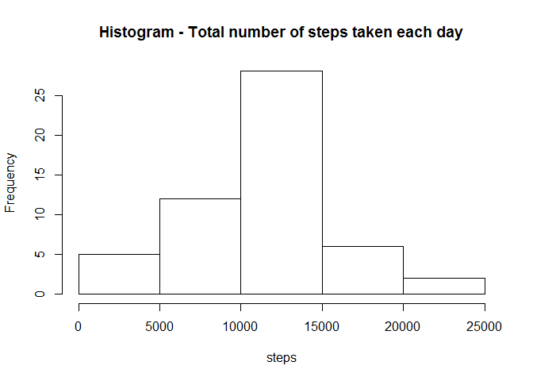
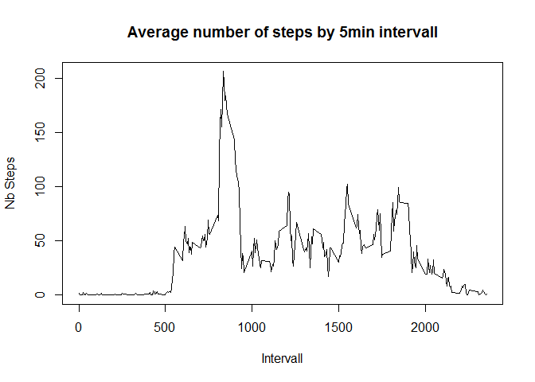
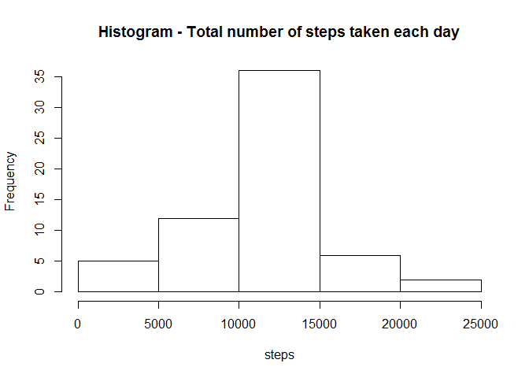
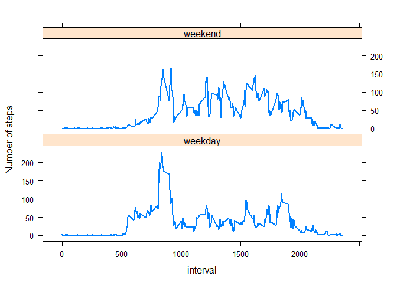

# Reproducible Research: Peer Assessment 1

Initialisation : set the current locale to eglish


```r
Sys.setlocale("LC_TIME", "English")
```

```
## [1] "English_United States.1252"
```


## Loading and preprocessing the data


let's load the activity data into R as a data frame and look at it.


```r
activity <- read.csv("./activity.csv", na.strings="NA")
```

Convert the date variable from a factor to a date type 


```r
library(lubridate)
activity$date <- ymd(activity$date)
```


## What is mean total number of steps taken per day?

create the dataframe :


```r
library(dplyr)
```

```
## 
## Attaching package: 'dplyr'
## 
## The following objects are masked from 'package:lubridate':
## 
##     intersect, setdiff, union
## 
## The following object is masked from 'package:stats':
## 
##     filter
## 
## The following objects are masked from 'package:base':
## 
##     intersect, setdiff, setequal, union
```

```r
activity.plot1 <- activity %>%
                  filter(!is.na(steps)) %>%
                  group_by(date) %>%
                  summarize(totalSteps=sum(steps))
```

create the plot :


```r
hist(activity.plot1$totalSteps, main="Histogram - Total number of steps taken each day", xlab="steps")
```

 

Calculate and report the mean total number of steps taken per day

```r
mean(activity.plot1$totalSteps, na.rm = T)
```

```
## [1] 10766.19
```


Calculate and report the median total number of steps taken per day

```r
median(activity.plot1$totalSteps, na.rm = T)
```

```
## [1] 10765
```


## What is the average daily activity pattern?

create a dataframe : 


```r
activity.plot2 <- activity %>%
                  filter(!is.na(steps)) %>%
                  group_by(interval) %>%
                  summarize(meanSteps=mean(steps))
```


Make the plot


```r
plot(activity.plot2$interval, activity.plot2$meanSteps, type="l",
     xlab="Intervall",
     ylab="Nb Steps",
     main="Average number of steps by 5min intervall")
```

 

Which 5-minute interval, on average across all the days in the dataset, contains the maximum number of steps ?


```r
maxDay <- activity.plot2 %>%
          filter(meanSteps==max(meanSteps))
```

## Imputing missing values

1. Calculate and report the total number of missing values in the dataset (i.e. the total number of rows with NAs)


```r
activity.na <- activity %>%
  filter(is.na(steps))

length(activity.na$steps)
```

```
## [1] 2304
```


Devise a strategy for filling in all of the missing values in the dataset. The strategy does not need to be sophisticated. For example, you could use the mean/median for that day, or the mean for that 5-minute interval, etc. we'll use the mean for that 5 minutes intervall

Create a new dataset that is equal to the original dataset but with the missing data filled in


```r
activity.nafilled <- activity

activity.nafilled$steps[is.na(activity.nafilled$steps)] <- activity.plot2$meanSteps[match(activity.nafilled$interval,activity.plot2$interval)][is.na(activity.nafilled$steps)]
```

Make a histogram of the total number of steps taken each day and Calculate and report the mean and median total number of steps taken per day. Do these values differ from the estimates from the first part of the assignment? What is the impact of imputing missing data on the estimates of the total daily number of steps?


```r
activity.plot3 <- activity.nafilled %>%
  filter(!is.na(steps)) %>%
  group_by(date) %>%
  summarize(totalSteps=sum(steps))
```


```r
hist(activity.plot3$totalSteps, main="Histogram - Total number of steps taken each day", xlab="steps")
```

 


```r
mean(activity.plot3$totalSteps, na.rm = T)
```

```
## [1] 10766.19
```

```r
median(activity.plot3$totalSteps, na.rm = T)
```

```
## [1] 10766.19
```


## Are there differences in activity patterns between weekdays and weekends?


```r
activity.nafilled$weekDay <- weekdays(activity.nafilled$date)

activity.nafilled$weekDay[activity.nafilled$weekDay == "Saturday" | activity.nafilled$weekDay == "Sunday"] <- "weekend"

activity.nafilled$weekDay[activity.nafilled$weekDay != "weekend"] <- "weekday"

activity.nafilled$weekDay <- as.factor(activity.nafilled$weekDay)

str(activity.nafilled)
```

```
## 'data.frame':	17568 obs. of  4 variables:
##  $ steps   : num  1.717 0.3396 0.1321 0.1509 0.0755 ...
##  $ date    : POSIXct, format: "2012-10-01" "2012-10-01" ...
##  $ interval: int  0 5 10 15 20 25 30 35 40 45 ...
##  $ weekDay : Factor w/ 2 levels "weekday","weekend": 1 1 1 1 1 1 1 1 1 1 ...
```


```r
activity.plot4 <- activity.nafilled %>%
  filter(!is.na(steps)) %>%
  group_by(interval, weekDay) %>%
  summarize(meanSteps=mean(steps))
```


```r
library(lattice)
xyplot(meanSteps ~ interval | weekDay, data = activity.plot4, type = "l", lwd = 2, layout = c(1, 2), ylab = "Number of steps")
```

 


